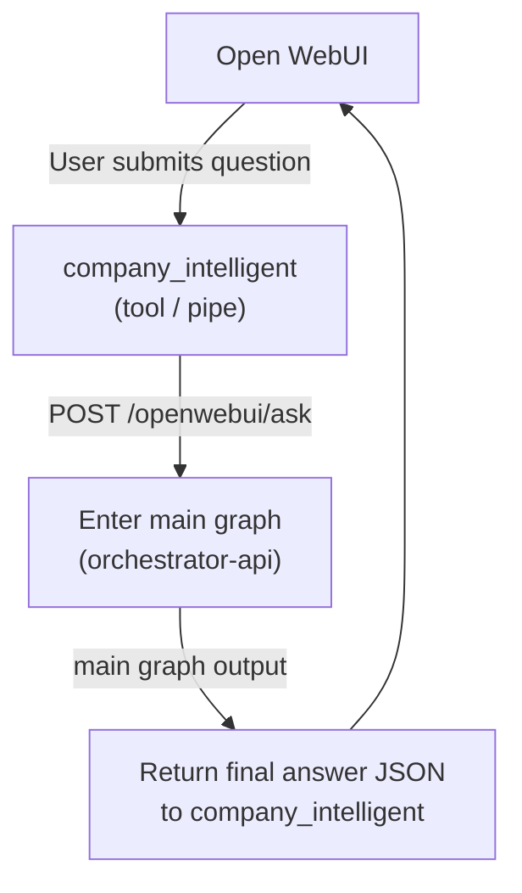
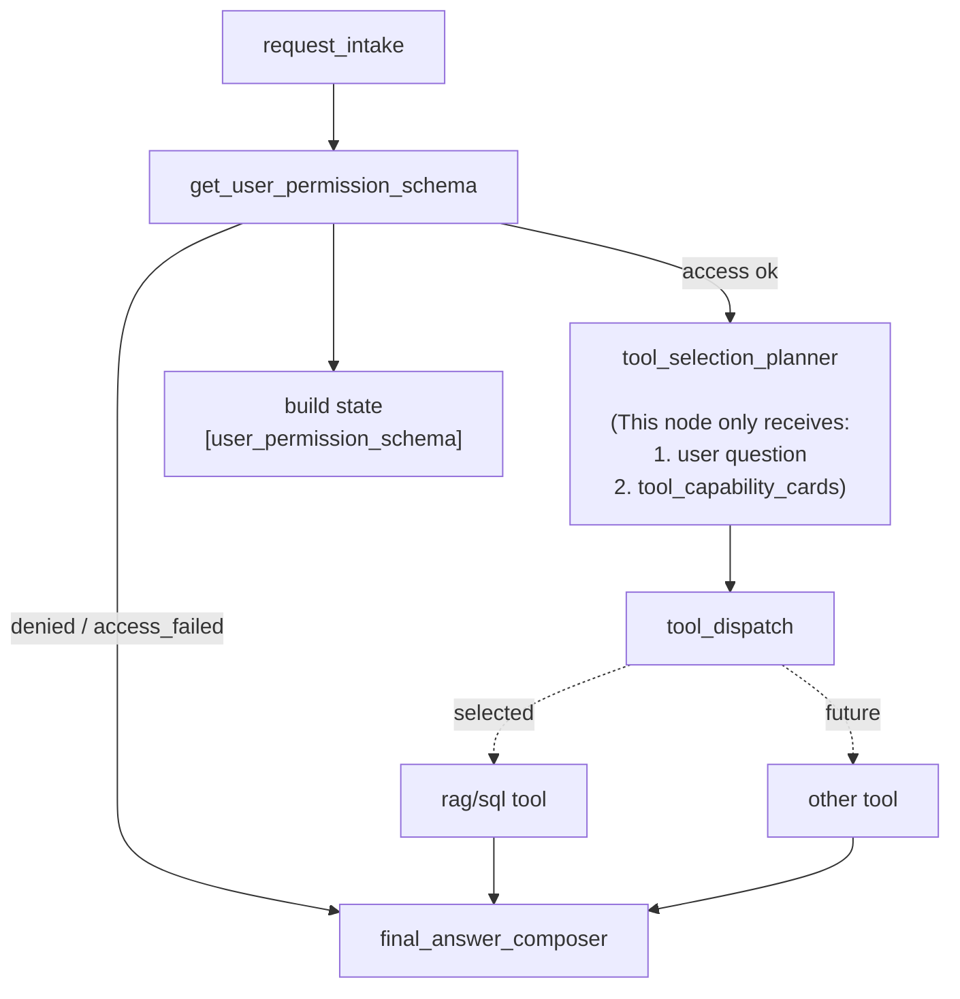
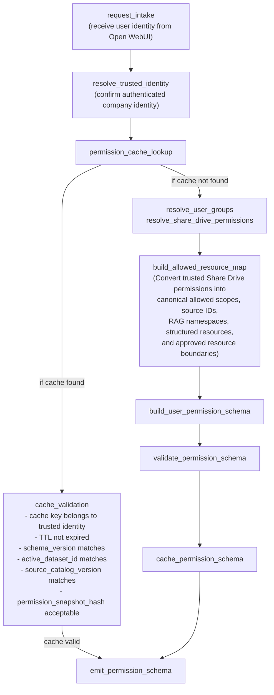
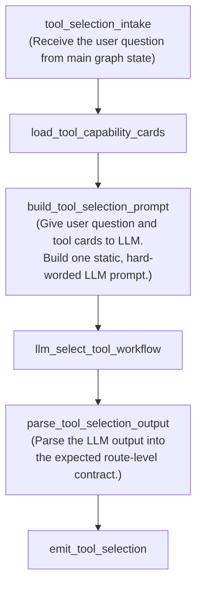
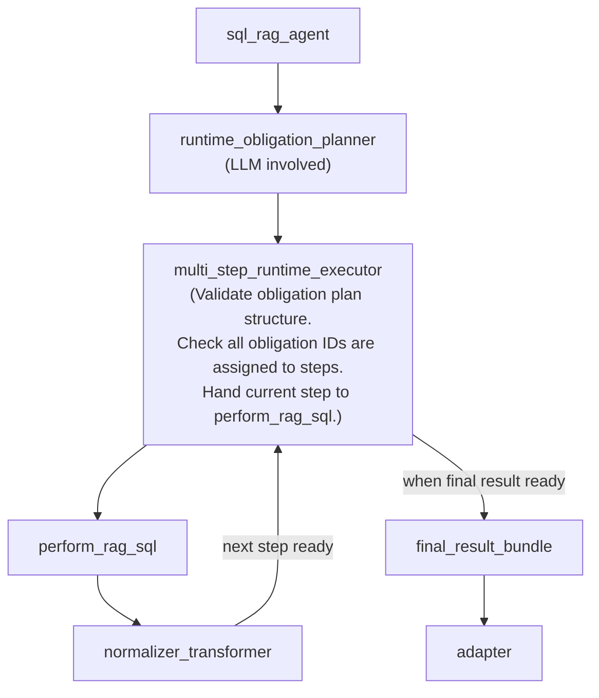
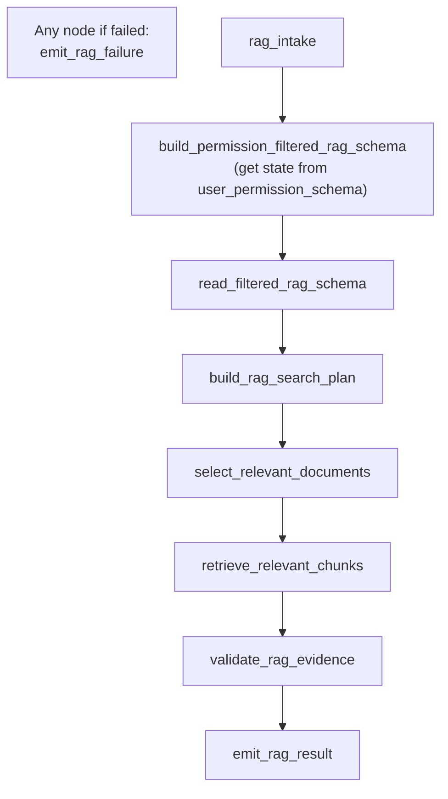
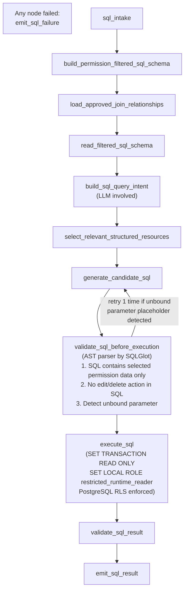
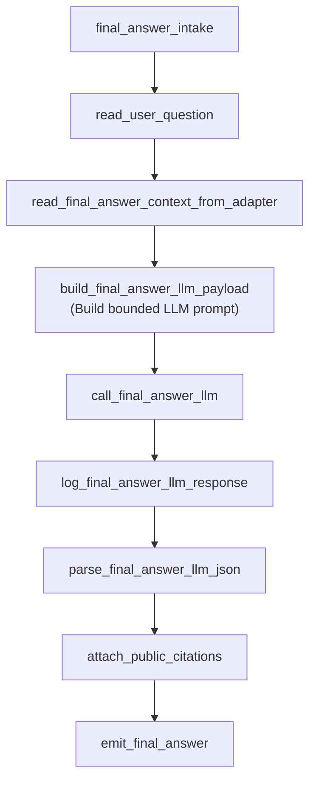

# Architecture — Company Intelligent

This document describes the internal workflow architecture of the Company Intelligent system.

The system is composed of 8 interconnected workflows. Each workflow owns its own boundary. Crossing a boundary is a design violation.

---

## 1. System Overview

How a user question travels from Open WebUI into the backend and back.

---

## 2. Main Graph

The main graph is the central orchestrator. It is **strictly a router** — it does not build SQL context, perform retrieval, or evaluate evidence.

---

## 3. `get_user_permission_schema`

Resolves who the user is and exactly what data they are permitted to access. The result becomes the single permission source for the entire request — no downstream node re-resolves permissions.

---

## 4. `tool_selection_planner`

Uses the LLM to select which backend tool workflow should handle the request. This node **only selects a route** — it does not decide how the tool executes, does not check permissions, and does not build SQL or RAG context.

> **Design note:** In the current demo, only one tool workflow exists (`sql_rag`), so this planner will always route there. However, this subgraph is intentionally designed as a standalone workflow so that adding future tool workflows (e.g., a mailbox agent, a calendar reader, a web retriever) requires **no changes to the main graph** — only a new tool capability card and a new workflow entrypoint. This architecture demonstrates forward compatibility, not just current functionality.

---

## 5. `rag/sql` Tool Workflow

The main backend AI agent that handles company data questions. It plans how many SQL and RAG steps are needed, executes them deterministically, and bundles the validated results.

---

## 6. RAG Subgraph

Handles document retrieval steps. Operates only within the permission boundary set by `get_user_permission_schema`. Never writes a final answer directly.

---

## 7. SQL Subgraph

Handles structured data query steps. SQL is generated from a permission-filtered schema, validated by AST parser (SQLGlot), and executed under a restricted database role with Row-Level Security enforced.

---

## 8. `final_answer_composer`

Assembles the final user-facing answer from validated, permission-safe evidence only. The LLM at this stage is bounded — it can only use the validated evidence passed to it; it cannot access raw data, raw SQL, or restricted content.

---

## Boundary Summary

| Workflow | What it owns | What it must NOT do |
|---|---|---|
| **Main Graph** | Routing, state passing, dispatch | Build SQL context, retrieve data, evaluate evidence |
| **get_user_permission_schema** | Identity resolution, permission map | Allow downstream to re-resolve permissions; downstream must read from state only |
| **tool_selection_planner** | Route-level tool selection — decide which workflow handles the request | Check permission, decide SQL vs RAG, build context, inspect resource lists |
| **rag/sql Tool** | Multi-step obligation planning, child dispatch, result bundling | Re-resolve permission, compose final answer |
| **RAG Subgraph** | Permission-filtered document retrieval | Write final answer, access non-permitted sources |
| **SQL Subgraph** | Permission-filtered SQL generation, validation, execution | Execute without AST validation, bypass RLS |
| **final_answer_composer** | Final answer writing from validated evidence | Access raw data, unvalidated chunks, restricted content |
